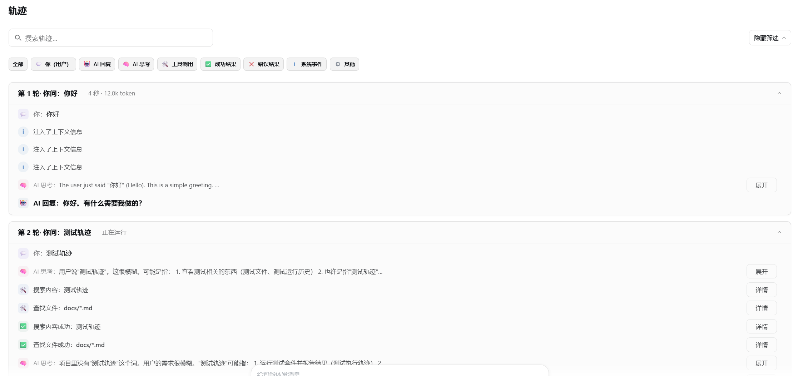
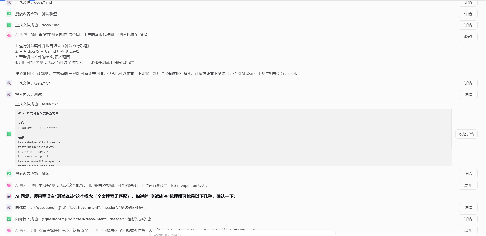

# dsh-trail

**友好轨迹** —— 一个对 DeepSeek Harness Web「轨迹」页签的新手友好替代：原始事件账本变成
人人都能看懂的故事线。

[English](README.md) · [使用指南](docs/usage.md) · [开发指南](docs/development.md)

内置轨迹视图是为专家设计的工具：术语不翻译且全界面无图例、工具栏五个开关、可缩放/拖选
的时间轴、独立的检查器，还有一张回答不了「我问了什么 → AI 怎么想 → 做了什么 → 结果如何」
的事件表。`dsh-trail` 用故事线设计替换这个页签——每轮问答一张可折叠卡片、工具名通俗中文、
参数内联预览、每个状态都有引导。它只读会话快照，没有 Host 半身，卸载即恢复原视图。

## 特性

- **回合卡片**——每轮一张卡片：你问了什么 → AI 怎么想 → 调用了哪些工具 → 结果如何；
  有数据时显示耗时、模型与 token 元信息。
- **工具名通俗中文化**——`read` 显示为「读取文件」+ 一句话说明；未知工具优雅回退。
- **参数内联预览**——行内直接显示被操作的文件/命令；原始参数、结果、耗时与错误元数据
  折叠进「详情」。
- **类别筛选**——「全部」+ 八个行类别，可组合选择，跨会话记忆。
- **模糊搜索**——忽略大小写、标点与全角形式；多词按有序子序列匹配。
- **进行中回合**——虚线卡片 + 状态胶囊（正在思考 / 生成中… / 正在运行 · Ns）+ 旋转动画；
  耗时从不虚构。
- **零产品耦合**——只从会话快照顶层字段渲染；无 Host 半身、无新增数据端点。

## 界面预览

官方 Web GUI 中的友好轨迹视图——回合卡片逐轮概括，思考、工具参数与完整回复默认折叠、
点击展开：






## 安装

```sh
dsh plugin --profile web add dsh-trail dsh-trail-bundle
```

重启 profile 后打开任意会话：「轨迹」页签即变为故事线视图。bundle 会禁用内置
`ui-trajectory` 行并在其位置挂载本视图，因此页签栏只有一个「轨迹」。

恢复原视图：

```sh
dsh plugin --profile web remove dsh-trail dsh-trail-bundle
```

## 快速开始

打开会话，点击「轨迹」。自上而下像读故事一样阅读：用「展开」查看折叠的思考或回复，
在工具行点「详情」查看原始参数、结果、耗时与 token。搜索框可跳转到某个文件或命令，
类别条可只看某一类（如「工具」）——浏览期间两者持续生效。

## 架构

一个仓库、两个 npm 包。`dsh-trail` 是客户端插件：注册 `conversation.view` 中
`id: 'trajectory'` 的格子，只从会话快照顶层字段渲染（`nodes`、`turnTimings`、
`partial`、`runningCalls`、`hasMore`、`loadingOlder`、`openState`）。
`dsh-trail-bundle` 是 patch 组合包，其 `cordis.patch.yml` 插入插件行并把内置
`ui-trajectory` 行设为 `disabled: true`。设计决策记录在仓库内部工作文档（不随包发布）。

## 已知局限与后续工作

- **仅 Web GUI**——插件面向 web 壳（peer 依赖 `react` ^18）；其他壳尚未验证。
- **简体中文优先**——v1 的界面文案（标签、工具名、引导）为简体中文；英文 locale 待办。
- **依赖兼容投影字段**——插件读取的 `nodes`/`turnTimings`/`partial`/`runningCalls` 等
  是产品的兼容投影，已验证于 dsh 0.1.0-rc.5；产品若移除这些字段需同步升级本插件。
- **回合分组是启发式**——`user`/`tool-result` 节点不携带回合号，回合边界按节点顺序
  推断，个别会话可能划错。
- **不与原视图功能对等**——时间轴 Overview、耗时切换与批量折叠按设计移除；核心信息
  折叠进「详情」，搜索保留。

## 文档

- [docs/usage.md](docs/usage.md) —— 安装、视图说明、筛选与搜索、卸载
- [docs/development.md](docs/development.md) —— 构建、测试、发布、贡献

## 许可证

MIT —— 见 [LICENSE](LICENSE)。
